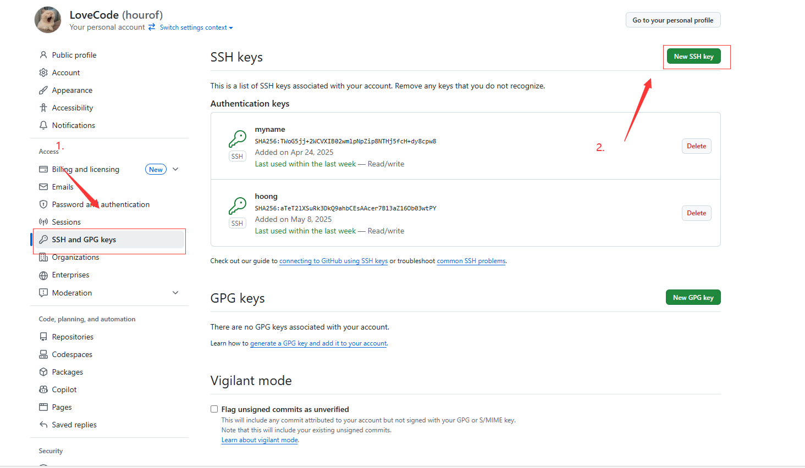
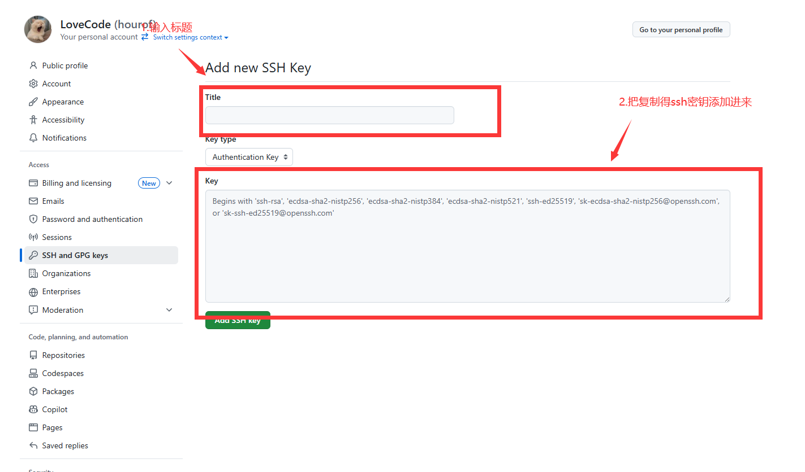

# 1.查看远程仓库地址

git remote -v

# 2.重新设置远程仓库地址

git remote set-url origin https://gitee.com/xx/xx.git (新地址)

# 3.查看提交历史记录

```python
#查看详细历史记录
git log

#显示简介的一行提交历史
git log --oneline

#显示分支合并图，同时显示分支和标签信息
git log --graph --decorate --oneline
```

# 4.分支命令

## 1.查看分支

```
git branch
```

## 2.创建分支

```
git branch <新分支名称>
```

## 3.切换分支

```
git checkout <分支名称>
```

## 4.切换到main分支

```
git branch -M main
```


# 5.切换到提交的某一份历史

> 首先查看提交历史记录
>
> 用git log  --oneline 命令


> 黄色字体就是提交的哈希值

```python
#切换到某一次提交的历史，比如切换到first commit这次
git checkout <6c27aa6>
```

## 1.  **查看完整提交历史**：

   ```bash
   git log
   ```
   这会显示所有提交的详细信息，包括提交哈希、作者、日期和提交消息。

## 2. **简洁模式（单行显示）**：
   ```bash
   git log --oneline
   ```
   这会以简洁格式显示提交记录，每个提交占一行，方便快速浏览。

## 3. **查看特定作者的提交**：
   ```bash
   git log --author="你的名字"
   ```
   这样可以筛选出某个作者的提交记录。

## 4. **查看最近 N 次提交**：
   ```bash
   git log -n 5
   ```
   这会显示最近 5 次提交。

## 5. **查看提交历史的图形化结构**：
   ```bash
   git log --graph --oneline --decorate
   ```
   这会显示分支和合并历史，适用于查看复杂的 Git 版本演变。

## 6. **查看某个文件的修改历史**：
   ```bash
   git log -- filename.txt
   ```

# 6.远程提交

## 1.给仓库起别名

```
#origin就是仓库别名 后面的地址是仓库地址
git remote add origin  https://github.com/hourof/programme.git
```

## 2.查看仓库的别名

```python
#查看 本地仓库关联的 远程仓库
git remote

#查看 本地仓库关联的 远程仓库信息
git remote -v
```

## 3.修改远程仓库的别名

```
git remote add     github git@github.com:toFrankie/repo-demo.git        新增 远程仓库别名
git remote rm      github                                                删除 已存在 远程仓库别名（只会移除本地仓库与远程仓库的管理，不会删除远程仓库的代码）
git remote rename  github gitlab                                     修改 远程仓库别名（也可以先删除再添加）
git remote set-url github git@github.com:toXXXX/repo-demo.git       更新 远程仓库别名 关联的 远程仓库

```

 ## 4.提交到远端仓库

```
git push -u origin main
```

## 5.合并分支

```
git merge feature-branch
```


## 6.提交历史记录出现的问题解决方案网址

[解决Git连接失败：Failed to connect to github.com port 443 after 21090 ms: Couldn‘t connect to server ‍-腾讯云开发者社区-腾讯云](https://cloud.tencent.com/developer/article/2405656)

# 5.用户信息

## 1.查看用户自己配置

```
git config --global --list
```

# 6.配置ssh

## 1.生成ssh密钥

> ssh-keygen -t rsa -C "这里换上你的邮箱"
>
> 询问得时候一路回车键就行,然后自动生成密钥
>
> 
>
> 查看邮箱命令
>
> git config --global --list

## 2.查看生成得密钥
<font color=Blue>cat ~/.ssh/id_rsa.pub</font>

把方框里面得内容复制


## 3.配置github





## 4.测试ssh连接
<font color="Blue">ssh -T git@github.com</font>

> 当返回这段英文时就代表配置成功
>
> Hi hourof! You've successfully authenticated, but GitHub does not provide shell access.

# 7.git本地仓库与远端仓库的对比

你可以使用 `git fetch` 和 `git diff` 来对比本地仓库和远端仓库的版本。以下是常见方法：

### 1. **检查本地和远端的差异**
```bash
git fetch origin
git diff HEAD origin/main
```
**解释：**
- `git fetch origin` 获取远端最新的状态，但不会合并到你的本地分支。
- `git diff HEAD origin/main` 让你看到当前本地分支与远端分支的差异（假设远端分支是 `main`）。

### 2. **查看提交历史对比**
如果你想看本地和远端的提交差异，可以使用：
```bash
git log HEAD..origin/main --oneline
```
如果本地比远端多了提交，它会列出本地额外的提交；如果远端比本地多了提交，它会列出远端的新增提交。

### 3. **检查是否有未推送的提交**
```bash
git status
```
如果有未推送的提交，它会提示你分支“落后于”远端，并建议你执行 `git push`。

### 4. **对比整个仓库**
如果想要检查本地和远端仓库的完整差异：
```bash
git fetch origin
git diff origin/main
```
这个命令会显示所有代码的变更。

如果你的本地仓库有多分支，你可以使用：
```bash
git branch -vv
```
它会显示本地分支是否落后或领先于远端分支。

你现在的本地仓库和远端仓库有冲突吗？需要帮忙解决的话，我可以帮你分析！💡

### 5.远程仓库与本地仓库冲突解决方法

这是 **Git 推送失败**的典型错误，错误信息 `[rejected]` 表明你尝试推送（`git push`）到远程仓库（GitHub）时，远程仓库拒绝了你的更新。

出现这个错误的原因只有一个：**远程仓库 (GitHub) 上有你本地没有的代码更新。** 也就是说，在你从远程仓库拉取（`git pull`）之后，**其他人或你自己在别的设备上**已经先一步向这个分支 (`main`) 推送了新的提交 (commits)。

------


#### 🧐 错误原因分析：本地与远程历史不一致


Git 是基于提交历史（Commit History）工作的。

1. **你本地的历史：** 假设你最新的提交是 **A**。
2. **远程仓库的历史：** 远程仓库的最新提交是 **B**。
3. **冲突发生：** Git 发现，如果接受你的提交 **A**，它就必须“倒退”或“覆盖”已经存在的提交 **B**。这种非快进（non-fast-forward）式的更新可能会导致数据丢失，所以 Git 默认会**拒绝** (`[rejected]`) 你的推送，以保护远程仓库的历史完整性。

------


#### 🛠️ 解决方案：先拉取，后推送


根据 Git 给你的提示 (`hint`)，解决这个问题的标准步骤是：**先用 `git pull` 集成远程的更改，然后再尝试推送。**


#### 步骤一：拉取远程更新 (Git Pull)


使用 `git pull` 命令，它相当于执行了两个操作：`git fetch`（获取远程更新）和 `git merge`（将远程更新合并到你本地分支）。

Bash

```
git pull origin main
```

- `origin`：远程仓库的别名（通常是 GitHub 仓库的默认名称）。
- `main`：你当前工作的本地分支名称。

执行 `git pull` 后，可能会发生两种情况：

1. **自动快进 (Fast-Forward):** 如果远程的提交 **B** 和你的提交 **A** 互相不冲突，Git 会自动将远程提交 **B** 添加到你的本地历史中。
2. **发生合并冲突 (Merge Conflict):** 如果远程的提交 **B** 修改了你本地提交 **A** 中也修改了的同一行代码，Git 会暂停并让你手动解决冲突。你需要编辑文件，选择保留哪个版本的代码，然后使用 `git add .` 和 `git commit` 来完成合并。


#### 步骤二：再次推送 (Git Push)


在成功完成拉取和可能的合并/解决冲突之后，你本地的提交历史就包含了远程的最新内容。此时，你可以安全地将你的更改推送到远程仓库了。

Bash

```
git push origin main
```

这次推送应该是成功的。

------


#### ⚠️ 特殊情况：强制推送 (Force Push)


如果你**非常确定**远程仓库的提交是错误的，并且你希望**完全覆盖**远程的历史，可以使用**强制推送**：

Bash

```
git push -f origin main
####  或者使用更安全的 --force-with-lease
#### git push --force-with-lease origin main
```

**📢 警告：** **除非你非常清楚你在做什么，否则不要使用强制推送！** 这会抹掉远程仓库的历史，导致其他协作者的工作丢失。在团队合作中，强制推送是被严格禁止的。

# 8.git status中文乱码

终端输入这段代码就可以了

```text
git config --global core.quotepath false
```

# 9.git历史版本还原

你可以使用 Git 来恢复某个文件的历史版本，具体方法如下：

### **方法 1：使用 `git restore`**
如果你想恢复某个文件到最近的提交状态（丢弃未提交的更改），可以使用：
```bash
git restore <file>
```
如果你想恢复到某个特定的提交：
```bash
git restore --source=<commit_hash> <file>
```
例如：
```bash
git restore --source=HEAD~1 example.txt
```
这会将 `example.txt` 恢复到上一个提交的状态。

### **方法 2：使用 `git checkout`**
如果你想恢复某个文件到特定的历史版本：
```bash
git checkout <commit_hash> -- <file>
```
例如：
```bash
git checkout abc123 -- example.txt
```
这会将 `example.txt` 恢复到 `abc123` 提交时的状态。

### **方法 3：使用 `git reset`**
如果你想恢复整个仓库到某个历史版本：
```bash
git reset --hard <commit_hash>
```
但请注意，这会丢弃所有之后的更改。

### **方法 4：使用 `git revert`**
如果你想撤销某个提交，但保留提交历史：
```bash
git revert <commit_hash>
```
这会创建一个新的提交来撤销 `commit_hash` 的更改，而不会影响其他提交。

你可以选择适合你的方式来恢复文件。如果你需要更精细的控制，比如仅恢复某个文件的部分更改，可以使用 `git diff` 来查看差异并手动修改。🚀
